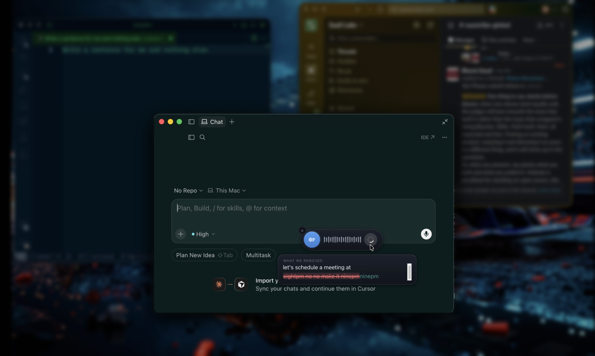

<div align="center">
  

  <h1>Verbatim</h1>

  <p><strong>Real-time, vendor-agnostic dictation with visible corrections.</strong></p>

  <p>
    Words stream in live as you speak. When you stop, the text cleans itself up —
    fillers, false starts, self-corrections — while <em>showing you exactly what was
    removed</em> before it's inserted into whatever field you were typing in.
  </p>

  <p>
    
    
    
    
  </p>
</div>

<p align="center">
  
</p>

> **Project status:** Pre-1.0 and under active development. The macOS desktop app is
> functionally complete (milestone M4) and daily-driver polish (M5) is in progress. There is
> **no published binary yet** — you build and run from source. See [Status & roadmap](#status--roadmap).

---

## Table of contents

- [What it is](#what-it-is)
- [Why it's different](#why-its-different)
- [How it works](#how-it-works)
- [Providers](#providers)
- [Requirements](#requirements)
- [Installation](#installation)
- [Quick start](#quick-start)
- [Configuration](#configuration)
- [Usage](#usage)
- [Repository layout](#repository-layout)
- [Development](#development)
- [Experimental](#experimental)
- [Status & roadmap](#status--roadmap)
- [Security](#security)
- [Contributing](#contributing)
- [License](#license)

---

## What it is

Verbatim is a dictation tool for macOS. A floating widget listens to your microphone, shows
a live transcript as you speak, then runs a correction pass that removes disfluencies and
resolves spoken self-corrections — and it renders the edit visibly (for example
`~~8 pm no no make it~~ 9 pm`) rather than silently rewriting your words. The cleaned result
is injected into the field that was focused before the widget opened.

The core is **vendor-neutral**: speech-to-text and the correction model are separate,
swappable roles, and you bring your own API key for the vendor you choose.

## Why it's different

- **Live transcript** — text appears while you speak, not only after you finish. The live
  layer never waits on the correction model.
- **Visible correction** — you see what was removed or replaced, not just the clean output.
- **Vendor-agnostic** — PyAI (default), Deepgram, OpenAI, or Anthropic behind one interface;
  speech-to-text and correction can use different vendors.
- **BYOK, local-first** — your keys live in the OS keychain and are sent only to the vendor
  you select. There is no content telemetry.

## How it works

The pipeline has two layers that run at different speeds:

```
mic ─► STT provider (WebSocket) ─► partial events ─► Layer 1: live raw text
                                     │  stableText  = locked (solid)
                                     │  activeText  = volatile tail (dim)
                                     └─ utterance end ─► Correction provider ─► compact edits
                                                              │
                                                 reconstruct(raw, edits) ─► { cleanText, ops }
                                                              │
                                            Layer 2: animate removals ─► inject cleanText
```

- **Layer 1** is instant and never blocks on the correction model — this is what makes it
  feel real-time.
- **Layer 2** runs when a segment finalizes. The correction provider returns only the spans
  that changed (compact edits); the client re-locates each span locally to rebuild the full
  keep/remove/replace timeline the UI animates. This keeps output tokens and latency low.

Two interfaces in `packages/core` define the whole contract — `STTProvider` and
`CorrectionProvider` — and each vendor is a single adapter file behind them. See
[`docs/architecture/overview.md`](docs/architecture/overview.md) for the full code map.

## Providers

Speech-to-text and correction are independent roles, so combinations are allowed (for
example Deepgram STT + Anthropic correction). The desktop app resolves both from its own
config store — set in the first-run window or in Settings — while the standalone backend
reads the `STT_PROVIDER` / `CORRECTION_PROVIDER` environment variables.

| Vendor | Speech-to-text | Correction | Required key |
|---|---|---|---|
| **PyAI** (default STT) | ✅ | — | `PYAI_API_KEY` |
| **Deepgram** | ✅ (streaming) | — | `DEEPGRAM_API_KEY` |
| **OpenAI** | ✅ | ✅ | `OPENAI_API_KEY` |
| **Anthropic** | — | ✅ | `ANTHROPIC_API_KEY` |
| **Nemotron** (optional, local) | ✅ (on-device, Apple Silicon) | — | No API key — model bundled in repo ([Git LFS](models/nemotron/README.md)) |

> **One key can be enough — but not every key covers both roles.** OpenAI is the only single
> key that does. PyAI and Deepgram give you working dictation with self-correction switched
> off; Anthropic can only clean up text something else transcribed. PyAI was removed as a
> correction vendor (it stays the default for speech-to-text and text-to-speech).

> **Multilingual:** PyAI's speech-to-text is English-only today, so non-English dictation
> routes STT through Deepgram or OpenAI. See
> [`docs/architecture/multilingual.md`](docs/architecture/multilingual.md).

## Requirements

### Web demo (browser)

| Requirement | Notes |
|---|---|
| **Node.js 20+** | 22 recommended |
| **macOS / Linux / Windows** | Any OS with Node |

No API key needed for **Demo (no mic)** mode. Live dictation in the browser needs a vendor key (see [Configuration](#configuration)).

### macOS desktop widget (recommended)

| Requirement | Notes |
|---|---|
| **macOS 11.0+** | Desktop app is macOS-only in this release |
| **Node.js 20+** | |
| **Rust** (stable) | Install via [rustup](https://rustup.rs) |
| **Xcode Command Line Tools** | `xcode-select --install` |
| **Vendor API key** | For cloud STT (PyAI, Deepgram, or OpenAI) — set in onboarding or Settings |
| **Accessibility + Microphone** | macOS prompts on first dictation |

First widget build compiles Rust and may take several minutes. Later runs are fast.

**Not needed for day-to-day dev:** [Bun](https://bun.sh) (only for packaged release builds), Git LFS (only if you use local Nemotron STT).

### Optional: local on-device STT (Nemotron)

Only if you want speech-to-text to run **entirely on your Mac** with no cloud transcription API:

| Requirement | Notes |
|---|---|
| **Apple Silicon Mac** | Metal backend |
| **Git LFS** | Fetches the bundled GGUF weights (~667 MB) — [install Git LFS](https://git-lfs.com) |
| **NeMo-Speech.cpp** | Built separately and linked at compile time — see [Local Nemotron setup](#macos-desktop-widget-local-nemotron-stt) |

Cloud STT (the default) does **not** need Git LFS, NeMo, or the bundled model.

---

## Installation

From the repo root:

```bash
git clone https://github.com/verbatimai/verbatim.git
cd verbatim
npm install
```

**If you plan to use local Nemotron STT**, also fetch the bundled model weights:

```bash
npm run setup:lfs
# equivalent to: git lfs install && git lfs pull
```

Skip `setup:lfs` if you only use cloud providers (PyAI / Deepgram / OpenAI).

**macOS widget only** — one-time native toolchain:

```bash
# Rust
curl --proto '=https' --tlsv1.2 -sSf https://sh.rustup.rs | sh
source "$HOME/.cargo/env"

# Xcode Command Line Tools (if not already installed)
xcode-select --install
```

---

## Quick start

### Web demo (browser)

```bash
npm run dev
```

Open **http://localhost:5173** and click **Demo (no mic)** — no microphone or API key required.

For live dictation: add a key to `.env` (see [Configuration](#configuration)) or use the in-browser key field, then click **Start dictation**.

### macOS desktop widget (cloud STT — default)

```bash
npm run widget
```

This starts the menu-bar app with cloud speech-to-text. No NeMo build, no Git LFS, and no bundled model required.

1. Complete **Welcome to Verbatim** onboarding (paste an API key) or **Set up later** and add a key in **Settings (⚙)**.
2. Grant **Microphone** and **Accessibility** when prompted (Accessibility is needed to type into other apps; without it, text is copied to the clipboard).
3. Focus a text field in any app, press **⌥Space**, dictate, and press **Stop** — corrected text is injected into that field.

**Demo mode** in the overlay works without a key or mic setup for trying the UI flow.

### macOS desktop widget (local Nemotron STT)

For fully on-device transcription, complete [Installation](#installation) including `npm run setup:lfs`, then build [NeMo-Speech.cpp](https://github.com/NVIDIA/NeMo-Speech.cpp):

```bash
git clone https://github.com/NVIDIA/NeMo-Speech.cpp
cd NeMo-Speech.cpp
./scripts/install.sh --source --backend metal --prefix $HOME/nemo-speech
```

Run the widget with the Nemotron feature linked:

```bash
export NEMO_SPEECH_PREFIX=$HOME/nemo-speech
npm run widget:nemotron
```

In **Settings → Speech-to-text**, choose **Nemotron (local)**. The app loads the GGUF from `models/nemotron/` in this repo — no Hugging Face account.

Full details: [`docs/architecture/local-asr-nemotron.md`](docs/architecture/local-asr-nemotron.md) and [`models/nemotron/README.md`](models/nemotron/README.md).

---

### First-run onboarding (desktop widget)

**On a fresh install a "Welcome to Verbatim" window opens by itself** (only while no vendor key is saved and you haven't dismissed it):

1. **Connect** — paste **one** API key. The vendor is detected from the key's shape and shown
   as an editable chip you can override, then checked against that vendor before anything is
   saved: a rejected key stops there, while an unreachable vendor saves the key anyway rather
   than calling it bad. If your key covers only one role, an inline slot offers the other.
2. **Two macOS permissions** — **Microphone** is requested inside the window; **Accessibility**
   deep-links to System Settings, and the window keeps polling so the row updates as soon as
   macOS reports the grant. Neither blocks you: without Accessibility, dictation copies to the clipboard instead of typing into
   the focused field.
3. **Give it one try** — hold the dictation hotkey and watch the live transcript, the
   strike-through cleanup, and the final text, in the window.

What each key gets you:

| The key you paste | Result |
|---|---|
| **OpenAI** | Both roles: speech-to-text **and** self-correction. Nothing more to add. |
| **PyAI** or **Deepgram** | Speech-to-text only — dictation works, self-correction stays off. The optional cleanup slot takes an OpenAI or Anthropic key to switch it on, now or later in Settings. |
| **Anthropic** | Cleanup only, so the window asks for a speech key before it lets you continue. |

A key pasted into the wrong role is refused with an explanation rather than silently
discarded. **Set up later** skips setup and is remembered — the window does not reappear on
the next launch. To pick it up again, use **Finish setup…** in the menu-bar menu, or the
**Finish setup** button the overlay offers if you try to dictate with nothing configured.

Once you're set up, press **⌥Space** (or whatever hotkey you configured) to toggle dictation;
focus a field in another app before you stop, and the corrected text is injected there.

## Configuration

### API keys

- **Desktop app (recommended):** the first-run window takes one key and works out the rest;
  **Settings (⚙)** has a row per vendor for adding, replacing or deleting keys afterwards.
  Keys are **never exposed to the renderer** — the Rust host injects them into the backend
  sidecar's environment, so the webview never sees a secret. They are written to a
  `secrets.json` with `0600` permissions in the app's config directory (the default backend);
  a hidden `keyStorage` setting can switch that to the **macOS keychain** instead.
- **Local development / standalone backend:** copy `.env.example` to `.env` at the repo root
  and fill in the key(s) you use. `.env` is git-ignored — never commit real keys.

```bash
cp .env.example .env
```

Relevant environment variables (see [`.env.example`](.env.example) for the full list):

| Variable | Purpose | Values / default |
|---|---|---|
| `STT_PROVIDER` | Speech-to-text provider | `pyai` (default) · `deepgram` · `openai` · `nemotron` (local, macOS) |
| `CORRECTION_PROVIDER` | Correction provider | `openai` (default) · `anthropic` |
| `PYAI_API_KEY` | PyAI key (BYOK) | — |
| `DEEPGRAM_API_KEY` | Deepgram key (BYOK) | — |
| `OPENAI_API_KEY` | OpenAI key (BYOK) | — |
| `ANTHROPIC_API_KEY` | Anthropic key (BYOK) | — |
| `PORT` | Backend WebSocket port | `8787` |

### Settings (desktop app)

The Settings window is where you change anything the first-run window didn't ask about. It
also provides a custom **vocabulary** list, snippet **text-expansion**, a
**formatting mode** (prose / message / code / raw), configurable **paste-last** and
**revert-to-raw** hotkeys, provider/language selection, and an opt-in, **metadata-only**
telemetry toggle (never content).

## Usage

| Action | Default |
|---|---|
| Toggle dictation (tap) / hold-to-talk | **⌥Space** |
| Paste last result | Configurable in Settings |
| Revert to raw (undo correction) | Configurable in Settings |

The widget never steals keyboard focus from the app underneath it, and it **refuses to inject
into secure/password fields** (it copies to the clipboard instead).

## Repository layout

This is an npm-workspaces monorepo.

```
verbatim/
├─ packages/core/      Vendor-neutral core: provider interfaces, registries,
│                      correction prompt + reconstructor, diff logic, tests
├─ apps/
│  ├─ widget/          Tauri macOS client — menu-bar app, non-activating overlay,
│  │                   settings + onboarding windows, native (Rust) integration
│  ├─ backend/         Local pipeline bridge; the desktop app spawns it as a
│  │                   key-injected sidecar (also runnable standalone for the web demo)
│  └─ web/             Vite browser demo UI
├─ models/
│  └─ nemotron/        Bundled Nemotron GGUF weights (Git LFS) for local STT
├─ docs/
│  ├─ product/         Product plan, roadmap, milestone tasks, status
│  └─ architecture/    Code map, vendor APIs, macOS injection, release/signing
├─ e2e/                Playwright end-to-end tests
├─ experiments/        Throwaway validation scripts, fixtures, UX prototypes
└─ scripts/            dev / widget / build-sidecar runners
```

Start with [`docs/product/roadmap.md`](docs/product/roadmap.md) for the milestone plan and
[`docs/architecture/overview.md`](docs/architecture/overview.md) for the code map.

## Development

### Commands

| Command | What it does |
|---|---|
| `npm install` | Install all workspace dependencies |
| `npm run setup:lfs` | Fetch bundled Nemotron model (Git LFS) — local STT only |
| `npm run dev` | Web demo at http://localhost:5173 |
| `npm run widget` | macOS widget with **cloud STT** (default; no NeMo build) |
| `npm run widget:nemotron` | macOS widget with **local Nemotron STT** (requires NeMo-Speech.cpp + `NEMO_SPEECH_PREFIX`) |
| `npm test` | Core unit/integration tests (Vitest) |
| `npm run test:e2e` | Playwright e2e (`npx playwright install chromium` first) |
| `npm run typecheck` | Type-check all workspaces |
| `npm run pipeline` | Headless core pipeline from the CLI |
| `npm run meetings` | Experimental meetings backend (see [Experimental](#experimental)) |

### Local Nemotron dev notes

- Set `NEMO_SPEECH_PREFIX` to your NeMo-Speech.cpp install prefix (e.g. `$HOME/nemo-speech`).
- Optional: copy `apps/widget/src-tauri/.cargo/config.toml.example` → `.cargo/config.toml` and set your prefix there (file is git-ignored).
- Model weights are read from `models/nemotron/` in the repo after `npm run setup:lfs`.

Troubleshooting for the web demo (dev-server reachability, mic permissions, ports) lives in
[`docs/troubleshooting.md`](docs/troubleshooting.md).

### Common issues

| Problem | Fix |
|---|---|
| Widget Rust build fails looking for NeMo | Use `npm run widget` (cloud STT) instead of `widget:nemotron`, or build NeMo-Speech.cpp and set `NEMO_SPEECH_PREFIX` |
| `Bundled Nemotron model not found` | Run `npm run setup:lfs` from the repo root |
| Git clone shows a tiny `.gguf` pointer file | Git LFS not pulled — run `git lfs install && git lfs pull` |
| First `npm run widget` is slow | Normal — Rust/Tauri cold compile; subsequent runs are faster |
| Text doesn't inject into other apps | Grant **Accessibility** in System Settings → Privacy & Security |
| `cargo: command not found` | Install Rust: `curl --proto '=https' --tlsv1.2 -sSf https://sh.rustup.rs \| sh` |

> **Native (Rust) code** under `apps/widget/src-tauri` must be built and verified on macOS;
> it cannot be compiled in a non-macOS environment.

## Experimental

The following are present in the codebase as prototypes and are **not yet stable or verified
end-to-end**. Treat them as previews:

- **Meetings ("Granola mode")** — dual-stream (you + system audio) meeting capture,
  transcription, and templated summaries. Runs a separate backend (`npm run meetings`) and
  requires a macOS loopback audio device. See
  [`docs/product/meetings-plan.md`](docs/product/meetings-plan.md).
- **Command mode / wake word** — scaffolding for spoken commands and wake-word activation.

## Status & roadmap

**M4 (desktop app + multi-vendor + configuration) is functionally complete; M5 (daily-driver
polish) is in progress.**

- **Done (M0–M4):** headless core pipeline, live web demo, macOS focus-capture + injection,
  menu-bar desktop app with a focusable settings window, Rust config store + keychain, all
  four vendor adapters, and release sidecar packaging.
- **In progress (M5):** reliability (retry + auto-reconnect + keepalive), custom vocabulary,
  formatting modes, revert-to-raw undo, a concurrency contract, and opt-in metadata-only
  telemetry. Remaining: on-Mac verification, a performance pass, and a two-week dogfood.
- **Planned (M6, v1.0):** Windows support, signed builds, auto-update, and a public release.

Details: [`docs/product/roadmap.md`](docs/product/roadmap.md),
[`docs/product/m5-tasks.md`](docs/product/m5-tasks.md), and
[`docs/product/STATUS.md`](docs/product/STATUS.md).

## Security

- **API keys** are stored in the OS keychain, never written to disk in plaintext, never
  bundled into the client, and never exposed to the renderer process. They are sent only to
  the vendor's own API over TLS.
- **Audio and transcripts** are streamed only to the vendor you select. There is **no
  telemetry of audio or transcript content**; any usage analytics are opt-in and
  metadata-only.
- **Text injection** targets the previously focused field and refuses secure/password inputs.
- Secret scanning (`gitleaks`), SAST (CodeQL), and dependency auditing gate every pull
  request.

Report vulnerabilities privately — see [SECURITY.md](SECURITY.md). Do not open a public issue
for security problems.

## Contributing

Contributions are welcome. Please read [CONTRIBUTING.md](CONTRIBUTING.md) first — it covers
the ground rules (never commit secrets; keep the core vendor-neutral), how to install the
pre-commit hooks, how to add a new provider, and the Conventional Commits style.

## License

[MIT](LICENSE) © 2026 Saaslabs Technology.
