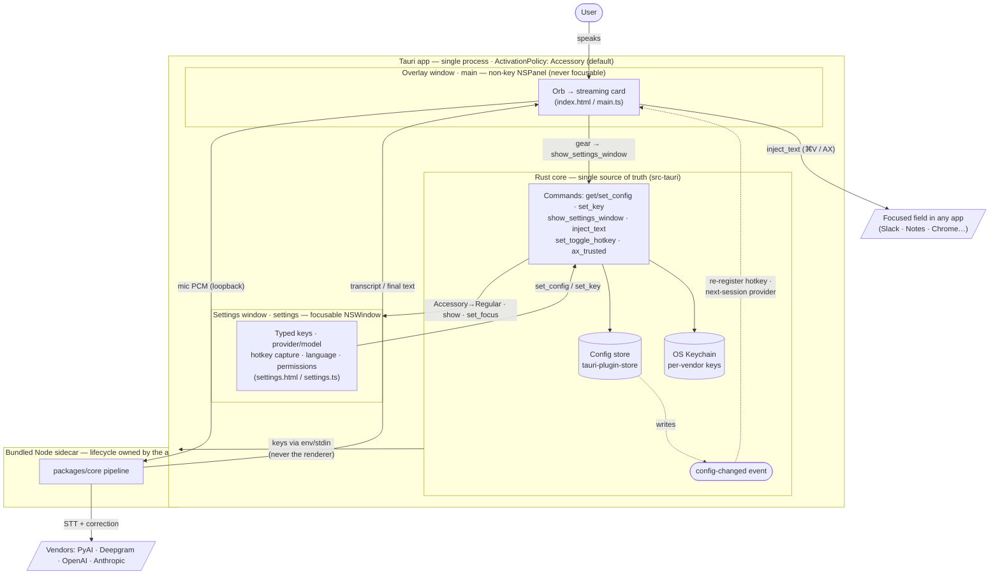
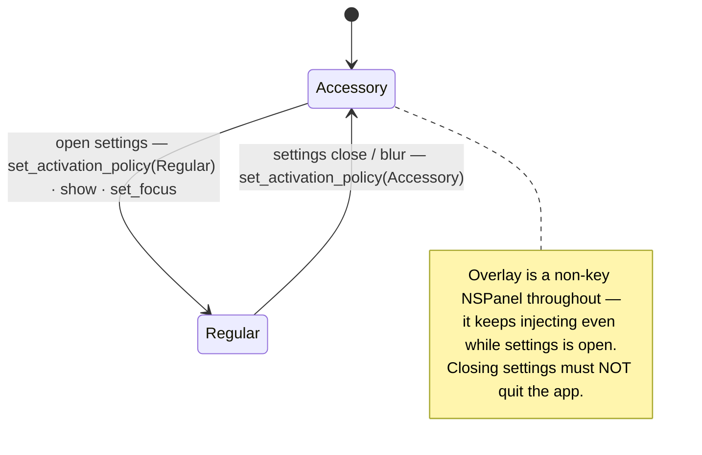

# Desktop App — Window Architecture (overlay + settings)

How the widget is split into **two windows in one process**, backed by a shared Rust core. Rationale and phased build live in `../product/m4-tasks.md` (M4, Phase 4.2–4.9). This is the quick map for someone reading the code.

## The model in one line

One Tauri app, **two webview windows, one Rust brain**. The **orb + widget** is a focus-less floating panel that streams and injects; the **desktop app (settings)** is a normal focusable window for configuration; the **Rust core** underneath owns config + keychain and is the only thing that talks to vendors.

## Component + event flow



## The two windows

| | **Overlay (orb + widget)** | **Desktop app (settings)** |
|---|---|---|
| tauri window | `main` (existing) | `settings` (new) |
| kind | non-activating, **non-key `NSPanel`** (`can_become_key_window:false`, `is_floating_panel:true`) | ordinary **focusable `NSWindow`** (`decorations:true`, `focus:true`, `alwaysOnTop:false`, `visible:false`, ~480×620) |
| entry point | `index.html` / `src/main.ts` | `settings.html` / `src/settings.ts` (Vite multi-page — both are Rollup inputs) |
| job | orb → streaming card → **text injection**; never steals focus | all configuration: **typed** keys, provider/model dropdowns, real hotkey capture, language, permission status |
| focus | never takes keyboard focus (that's what lets injection land in the target app) | takes focus so you can actually type |
| settings UI | **none** after the split — the gear just opens the settings window | owns 100% of it |

## The shared Rust core (single source of truth)

Neither window owns state. Both read/write through Rust commands, so the two views can never disagree.

- **Config store** — `tauri-plugin-store` persists the core `AppSettings` (`sttProvider`, `correctionProvider`, `language`) **plus widget-only prefs** (`hotkey`, `dockIcon`). Commands `get_config()` / `set_config(patch)`.
- **Keychain** — per-vendor secrets via `keyring` (`set_key`/`has_key`/`delete_key`). Never plaintext to disk, never bundled, never logged, **never handed to the renderer**.
- **`config-changed` event** — emitted on any write; the overlay listens and reacts live (re-registers the hotkey, uses the newly-selected provider/model on the next dictation) — no restart.
- **Sidecar hand-off** — Rust reads the Keychain and passes the selected keys to the bundled Node sidecar via **env/stdin**; the webview only ever streams mic PCM over loopback. Keys never transit the renderer (see `vendor-transport.md`).

## The one trick — activation policy

A non-activating app can't give a window keyboard focus. So the app toggles policy only while settings is open, and the overlay panel stays non-key the whole time.



**Guardrail:** never make the overlay focusable to "fix" typing — that would break injection. Typing only ever happens in the settings window.

## File map

```
apps/widget/
├─ index.html · src/main.ts · src/style.css   Overlay (orb + card + inject); settings panel removed post-split
├─ settings.html · src/settings.ts            NEW — the desktop settings app
├─ vite.config.ts                             multi-page: register settings.html as a Rollup input
└─ src-tauri/
   ├─ tauri.conf.json                         add the `settings` window
   └─ src/main.rs                             show_settings_window + activation switch; config store
                                              (get/set_config, config-changed); keychain (set/has/delete_key,
                                              folds in key_*, get|set_toggle_hotkey, ax_trusted); sidecar spawn + key hand-off
```

> Rust (`src-tauri`) can't be compiled in every authoring environment — always `cargo build` / `npm run widget` on the Mac before sign-off.
