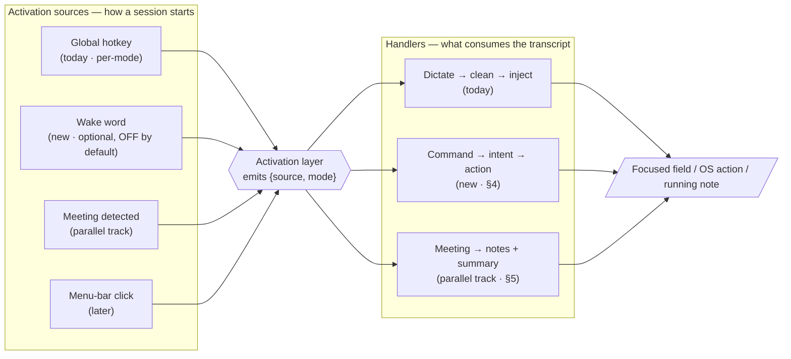

# Platform Evolution — from a dictation widget to voice input for your Mac

**Owner:** Mayank Banga · Saaslabs
**Date:** 13 Aug 2026
**Status:** Direction agreed; design frame captured. Not yet scheduled against the core milestones — see §7.
**Scope of this doc:** the generalization frame + the **command** handler + **wake word** activation. The **meeting/notetaker** handler is being planned in a parallel track and is referenced here only as a sibling (§5), not specced.

> Read `product-plan.md` for the *what/why* of the dictation core and `roadmap.md` for the milestone order. This doc sits alongside them: it describes how Verbatim grows **beyond** dictation without diluting it, and where the new work slots into the existing M0→M6 line.

---

## 1. The one-line reframe

Today Verbatim is **one activation source** (a global hotkey) feeding **one handler** (dictate → clean → inject into the focused field).

We generalize it into **voice input for your Mac**: a small set of **activation sources** that each start a voice session in a chosen **mode**, feeding a small set of **handlers** that each do something different with the transcript. Dictation stays the flagship handler; new capabilities are *additional handlers* shipped one at a time.

The discipline is not in the architecture — the seams already exist. It's in **sequencing**: never start a new handler until the previous one is demoable, and never let a new handler regress the dictation core or its exit criteria. This is the same operating principle the roadmap already runs on, applied to a second dimension.

---

## 2. The model: activation sources × handlers

Two axes, deliberately **decoupled**. *How* a voice session starts is independent of *what* it does with the result.



**Why decoupled matters.** A handler can be reached by more than one source. Command mode can be a distinct hotkey *and* an optional wake word. This is what stops wake words from becoming a mandatory always-on tax on everyone who'd rather press a key (§6).

**Mode is explicit, not guessed.** For anything that changes system state, we pick the handler at activation time (a per-mode hotkey or a distinct wake word) rather than letting a classifier infer "was that a command or dictation?" from the words. Implicit routing is more magical but misfires exactly where misfires are most expensive — you never want "open the door for me," dictated into a doc, to launch something. Predictability beats magic here.

---

## 3. Principles carried over from the core

These are the existing operating principles (`roadmap.md`), restated for the platform dimension:

- **Explicit activation stays the default.** The core promise — "the mic only opens on explicit activation" — holds for everyone who leaves the optional always-on sources off. Wake words are opt-in, off by default.
- **Vendor-neutral core.** A new handler adds at most a new *provider role* behind an interface, exactly like `STTProvider` and `CorrectionProvider`. No vendor detail leaks above the adapter boundary.
- **On-device where it must be.** Wake-word spotting runs **fully on-device**; raw audio is never streamed to a vendor just to listen for a trigger (§6). That would be a cost and privacy disaster and would break the "no backend required" promise.
- **Every step ends demoable.** No handler ships as "internal plumbing only."
- **Security is a gate, not a milestone.** New OS permissions (Automation/Shortcuts for commands) go through the same secret-scan/SAST/dep-audit gate and get documented alongside Accessibility.
- **Never regress the core.** A hard rule: no platform work is "done" if it degrades dictation latency, injection reliability, or the focus-never-stolen guarantee.

---

## 4. Handler: Command mode

Two sub-capabilities, deliberately sequenced. The first is the differentiated one; the second is a commodity we get cheaply by delegating.

### 4a. Field-scoped text-editing commands — *build this first*

Commands that act on **the field you're already dictating into**: *"make that bold," "delete the last sentence," "capitalize that," "new line," "scratch that."*

This is the command mode that's uniquely Verbatim's, because it's **scoped to the focused element** — which the app already reads (the Phase 3.4 Accessibility work: frontmost pid → `AXUIElementCreateApplication` → focused element). Siri can't do this; it doesn't know what field you're in. It reuses the two hardest things we already built — the **AX focus read** and **text injection** (`inject_text`, ⌘V / AX) — so it's additive to the core rather than a new pillar.

**Core change:** add a third provider role beside STT and Correction:

```ts
// packages/core — new role, same shape as the existing two
interface IntentProvider {
  // transcript (one utterance in command mode) → a structured, validated intent
  interpret(text: string, context: FieldContext): Promise<CommandIntent>;
}

type CommandIntent =
  | { action: 'format'; style: 'bold' | 'italic' | 'underline'; target: 'selection' | 'last-sentence' }
  | { action: 'delete'; target: 'last-word' | 'last-sentence' | 'selection' | 'all' }
  | { action: 'case';   mode: 'upper' | 'lower' | 'title'; target: 'selection' | 'last-sentence' }
  | { action: 'insert'; what: 'newline' | 'literal'; text?: string }
  | { action: 'noop';   reason: string };   // low confidence → do nothing, never guess
```

Adapters reuse the existing correction vendors (PyAI / OpenAI / Anthropic) — same registry/factory pattern, one file per vendor, no core surgery. The executor turns a `CommandIntent` into AX/inject operations against the captured field.

**Determinism is the whole game.** A constrained action vocabulary, validated intents, and a bias to **`noop` on low confidence** rather than a plausible-but-wrong action. This is the command analogue of the correction pipeline's "validate the ops, fall back if malformed" discipline.

### 4b. System commands via Shortcuts delegation — *build cheap, don't reinvent*

Commands that act on the OS: *"open Slack," "volume up," "start a five-minute timer."*

Be clear-eyed: this is a **commodity**. Siri, Raycast, Alfred, and macOS Shortcuts already do it well, and a bespoke action engine would be us competing on Siri's turf. So we **don't build one**. We map the intent to **macOS Shortcuts / AppleScript / URL schemes** and let the OS execute. Benefits: a fraction of the work, and it's **user-extensible** for free — anyone can add their own Shortcut and Verbatim just needs to route the phrase to it.

The executor for this path lives in Rust (native `src-tauri`), dispatching to Shortcuts/AppleScript. Positioning, honestly: this is convenience, not a headline. The headline is 4a.

### Safety model for command mode

- **State-changing actions are explicit and predictable.** Reached by a distinct mode, never by a classifier guessing over dictation text.
- **A command that arrived in dictation mode is never executed**, and vice versa. The two paths don't cross.
- **Destructive or ambiguous actions confirm** (or are behind an allow-list) before running.
- New **Automation/Apple Events permission** prompts are expected for 4b; documented alongside Accessibility in the permissions story.

---

## 5. Handler: Meeting notes *(parallel track — reference only)*

Being planned in a separate session. Listed here so the frame stays whole and so the seam accommodates it. The one thing to keep in view at the architecture boundary: the meeting handler uses a **different capture source — system/loopback audio (ScreenCaptureKit or a virtual device), not the mic** — because it must hear the *other* participants. That's a new capture + permission path (Screen Recording), and it's why "meeting" is both an activation source (auto-detected) and a handler. The activation layer in §2 is drawn to leave room for it; the details live in that track's doc.

---

## 6. Activation source: wake word (optional, off by default)

Wake words are **one optional activation source among several**, not the organizing principle. They earn their keep in genuinely hands-free moments; they should never be the *only* way to reach a handler.

**Hard constraint — fully on-device.** A small local keyword model does the always-on listening and never streams audio anywhere. Only *after* it fires does the normal vendor STT pipeline spin up. Engine options, in MIT-friendliness order:

| Engine | License posture | Integration | Note |
|---|---|---|---|
| **openWakeWord** (or a small custom ONNX keyword model) | Open, permissive — fits an MIT project | ONNX runtime in Rust (e.g. `ort`); more wiring | ✅ **Chosen (13 Aug 2026)** — keeps the OSS core MIT-clean |
| **Picovoice Porcupine** | Proprietary SDK, free personal tier, **commercial licensing** | Mature Rust bindings, lowest CPU, easiest day-one | Rejected for the OSS core — a proprietary dependency conflicts with MIT |

> **Decision (13 Aug 2026): openWakeWord.** MIT compatibility over raw ease — a proprietary SDK in the OSS core is a non-starter. The engine choice is locked; a licensing re-check at build time is still prudent (terms change), but it doesn't reopen the decision. Remaining sub-choices are the model (a stock "hey-verbatim"-style keyword vs a trained custom word) and the Rust ONNX wiring + CPU budget.

**Mode selection — reconsider "two wake words."** Your first instinct was wake-word-1 = commands, wake-word-2 = dictation. That's workable, but weigh it:

- Two hotword models **double the false-trigger surface** and both keep the mic hot.
- The **macOS orange mic indicator is on continuously** while listening — users notice, some dislike it — plus a small but real **battery/CPU** draw.
- Alternatives: (a) **distinct hotkeys per handler** for power users + **one** optional wake word reserved for hands-free; or (b) **one** wake word to "wake," then route on the first word(s). Option (b) is more magical but reintroduces the guess-the-mode risk for state-changing commands (§2).

**Recommendation:** default to per-mode hotkeys + a single optional wake word; treat multiple wake words as an advanced, opt-in setting rather than the primary UX. Whatever the default, it must be off by default, show a clear listening indicator, and be one toggle to disable.

---

## 7. How it lands in the code (reuse, not rewrite)

Almost everything needed already exists. The generalization touches two seams.

**Activation layer (`src-tauri`).** Today the ⌥Space state machine (`Pressed`/`Released`) emits `dictation` start/stop events the webview acts on. Generalize it to emit `{ source, mode }`. A new **on-device wake-word listener** becomes another source that emits the same shape. Per-mode hotkeys register through the existing configurable-hotkey machinery (`set_toggle_hotkey` / `CURRENT_TOGGLE`).

**Handler routing (overlay `main.ts`).** Today the finalized text maps to `inject_text`. Generalize to route by `mode`: `dictate → inject` (today), `command → edit-ops via AX/inject (4a) or ask Rust to run a Shortcut (4b)`.

**Core (`packages/core`).** Add the `IntentProvider` role beside `STTProvider` + `CorrectionProvider`, resolved through the same registry/factory that already fails fast on missing keys. Command adapters reuse the correction vendors.

**Native executors (`src-tauri`).** Field-editing (4a) reuses `inject_text` + the AX read. System commands (4b) add a Shortcuts/AppleScript dispatcher.

**Already in place, reused as-is:** the hotkey seam, AX focus read (3.4), injection (3.1/3.4), config store + `config-changed` live refresh, keychain, and the focusable settings window (M4) for the new toggles.

> **Reminder:** all `src-tauri` changes must be `cargo build` / `npm run widget`-verified on the Mac — they can't be compiled in the cloud authoring env.

---

## 8. Proposed roadmap placement

The core line is **not** disturbed: `M4 (finish) → M5 (polish) → M6 (v1.0)` stand exactly as written in `roadmap.md`. The platform work is **additive and starts after M4 ships**, so it never blocks the daily-driver and OSS-release path.

Proposed as a **platform track** (numbering to be reconciled with the meeting-mode track before it's folded into `roadmap.md`, to avoid renumbering churn across two sessions):

| Step | Handler / source | Why here | Reuses |
|---|---|---|---|
| **P1** | Command mode — **field-scoped editing** (4a) | Differentiated; smallest build; proves the `IntentProvider` role | AX read + `inject_text` |
| **P2** | Command mode — **system commands via Shortcuts** (4b) | Cheap; commodity; extensible | Native dispatcher only |
| **P3** | **Wake word** activation source (§6) | Optional layer over P1/P2 + dictation | On-device engine + hotkey seam |
| **(sep.)** | **Meeting notes** handler (§5) | Own capture path; own value; own risk | Parallel track |

Each step keeps the existing gates: it ends in a demo, the next doesn't start until it's demoable, and **none of them regress the dictation core**.

---

## 9. Open decisions

1. **IntentProvider model.** Reuse the correction vendors, or add a dedicated fast/cheap model so commands feel instant? Set a command latency budget (should feel as immediate as dictation's Layer 1).
2. ~~**Wake-word engine.**~~ **Resolved (13 Aug 2026): openWakeWord**, chosen for MIT compatibility (§6). Open sub-choices: stock vs trained custom keyword, and the on-device CPU/battery budget.
3. **Default activation UX.** Per-mode hotkeys + one optional wake word (recommended) vs two wake words vs one-wake-plus-routing.
4. **Command allow-list + confirmation policy** for destructive/ambiguous system actions.
5. **Permissions story.** Automation/Apple Events prompts for 4b, documented alongside Accessibility (and, on the meeting track, Screen Recording).

---

## 10. One-line summary

We're not bolting on a wake word, an assistant, and a notetaker. We're generalizing Verbatim from *dictation* to *voice input with pluggable activation sources and pluggable handlers* — then shipping handlers one at a time, on top of the seams we already built, without ever breaking the core.
